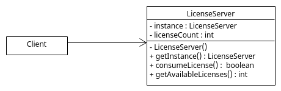

# Examen Corte 2

## Ejercicio 10

Un sistema de licencias de software SaaS debe garantizar que, durante toda la vida de la aplicación, exista un único y mismo objeto LicenseServer para controlar el consumo de licencias y ofrecer un punto de acceso global al contador.

***

## UML

