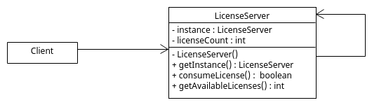

# Examen Corte 2

## Ejercicio 10

Un sistema de licencias de software SaaS debe garantizar que, durante toda la vida de la aplicación, exista un único y mismo objeto LicenseServer para controlar el consumo de licencias y ofrecer un punto de acceso global al contador.

***

## UML

***

## Diagrama De Secuencia

### Secuencia cuando Hay Licencias Disponibles

### Secuencia cuando No Hay Suficientes Licencias Disponibles

***

## 📌 ¿Qué representa?

Describe el flujo completo de uso del `LicenseServer`:

1. Acceso a la instancia única mediante `getInstance()`
2. Consulta del número de licencias disponibles
3. Consumo de licencias (dos exitosas y una fallida por agotamiento)
4. Revisión final del contador